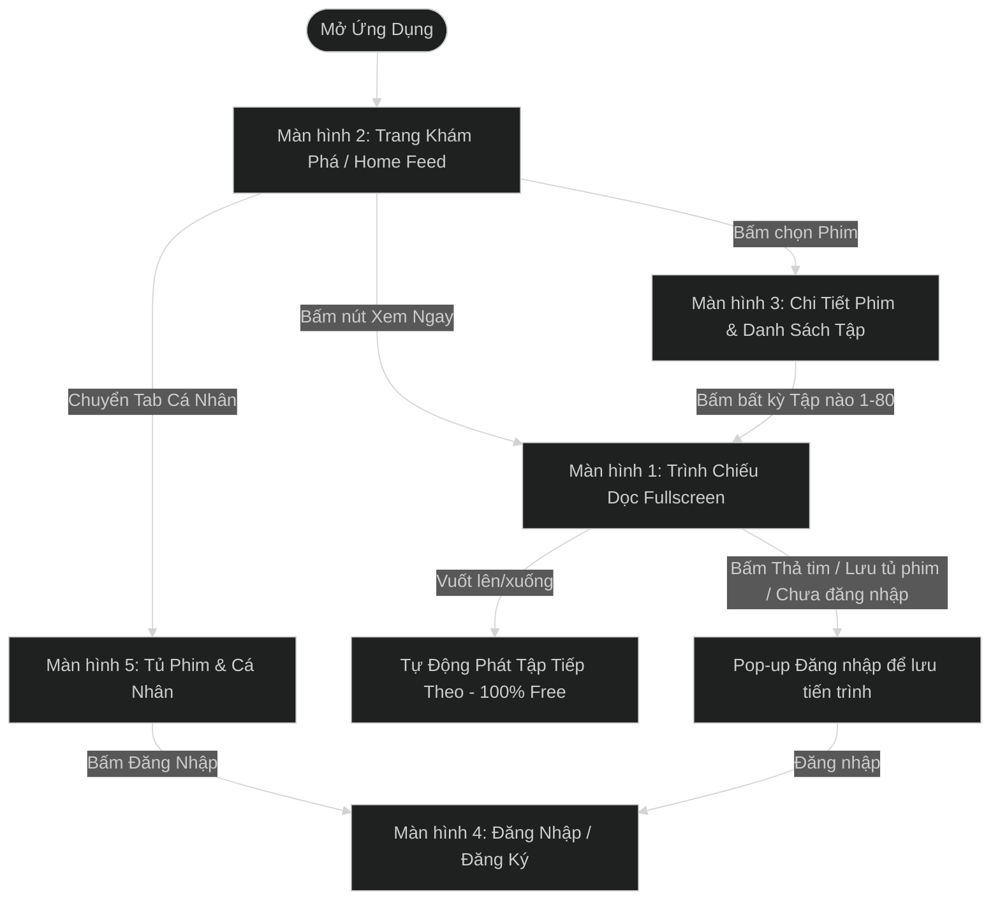

# TÀI LIỆU VẼ WIREFRAME & PHÂN TÍCH NGUYÊN MẪU ỨNG DỤNG PHIM NGẮN (SHORT DRAMA APP)
> **Benchmark đối chiếu:** App PineDrama - Short Dramas (TikTok Ltd.)  
> **Cập nhật:** Đã bỏ hoàn toàn Nạp Xu & Ổ Khóa - Mô hình Xem Phim Miễn Phí 100% (Free Access All Episodes)  
> **Thực hiện bởi:** BA Senior & Product Owner & Lead UI/UX Designer  
> **Định dạng lưu trữ:** UTF-8 Standard  
> **Thư mục:** `c:\Users\hoang\OneDrive\Desktop\Freelance\result_docs`

---

## 1. TỔNG QUAN DỰ ÁN & MÔ HÌNH TRUY CẬP (100% FREE ACCESS MODEL)

### 1.1 Khái niệm sản phẩm
Ứng dụng Phim Ngắn (Short Drama App) là nền tảng giải trí xem video dọc dạng ngắn (1 - 3 phút/tập), độ phân giải cao (HD/4K), phục vụ nhu cầu giải trí nhanh mọi lúc mọi nơi.

### 1.2 Mô hình Truy cập Phim Miễn Phí 100% (No Lock / All Episodes Free)
1. **Truy cập Miễn Phí Trọn Bộ (100% Free All Episodes):** Tất cả các tập phim từ Tập 1 đến Tập cuối (Tập 80+) đều mở Miễn Phí hoàn toàn. Người dùng không cần mua xu hay trả phí để xem các tập tiếp theo.
2. **Không có Ổ Khóa (No Lock Icons):** Giao diện loại bỏ toàn bộ icon Ổ khóa 🔐, loại bỏ các màn hìnhPaywall/Unlock.
3. **Mục đích Đăng nhập / Đăng ký:**
   - Người dùng có thể xem phim ngay lập tức mà không cần đăng nhập.
   - Đăng nhập (qua Google, SĐT/Email) được khuyến khích để **lưu Tủ Phim**, **thả tim/bình luận** và **đồng bộ Lịch sử xem phim** giữa các thiết bị.

---

## 2. KIẾN TRÚC MÀN HÌNH & LUỒNG ĐIỀU HƯỚNG (APP NAVIGATION FLOW)



---

## 3. CHUYÊN ĐỀ CHI TIẾT WIREFRAME 5 MÀN HÌNH CỐT LÕI

Below is the detail breakdown for 5 main screens, including layout wireframes, component specification, and user interaction rules.

---

### MÀN HÌNH 1: TRANG KHÁM PHÁ & TRANG CHỦ (HOME & DISCOVER - LANDING SCREEN)

#### 1.1 Khái niệm & Mục tiêu UX
Màn hình mặc định khi người dùng mới mở ứng dụng (Landing Screen). Hiển thị Banner Phim Hot nhất, danh mục **✨ Phim Đề Xuất Cho Bạn**, Bảng xếp hạng Top 10 và Danh sách phim mới cập nhật.

#### 1.2 Wireframe Layout
```
+-------------------------------------------------------------+
|  [LOGO APP]   [🔍 Tìm phim...]               [🔔 Thông Báo] |  <-- Top Bar & Header
+-------------------------------------------------------------+
|  [Cho Bạn]  [Hot Trend]  [Ngôn Tình]  [Chủ Tịch]  [Trả Thù] |  <-- Category Horizontal Tabs
+-------------------------------------------------------------+
| +---------------------------------------------------------+ |
| | [HERO BANNER SLIDER: PHIM HOT NHẤT TUẦN]                | |  <-- Big Featured Carousel Banner
| | Phim: "MẸ CHỒNG SIÊU CẤP & NÀNG DÂU TRIỆU ĐÔ"           | |
| | Trọn bộ 80 Tập • Thể loại Ngôn Tình                     | |
| | [▶ XEM NGAY TẬP 1]         [❤️ Yêu Thích]               | |
| +---------------------------------------------------------+ |
+-------------------------------------------------------------+
|  🔥 BẢNG XẾP HẠNG TOP 10 PHIM HOT                           |  <-- Top Chart Section
|  +------------+  +------------+  +------------+             |
|  | #1 POSTER  |  | #2 POSTER  |  | #3 POSTER  |             |
|  | 4.9★ - 1.2M|  | 4.8★ - 980K|  | 4.7★ - 850K|             |
|  | Tên Phim A |  | Tên Phim B |  | Tên Phim C |             |
|  +------------+  +------------+  +------------+             |
+-------------------------------------------------------------+
|  🎬 PHIM MỚI CẬP NHẬT                              [Xem tất cả]|  <-- Vertical Grid Section
|  +-----------------------+   +-----------------------+      |
|  | [POSTER 3:4]          |   | [POSTER 3:4]          |      |
|  | Cô Vợ Sát Thủ         |   | Tổng Tài Bá Đạo       |      |
|  | 80 Tập | 4.9★         |   | 65 Tập | 4.8★         |      |
|  +-----------------------+   +-----------------------+      |
+-------------------------------------------------------------+
| [🏠 Trang Chủ]         [🎬 Xem Phim]     [👤 Tài Khoản / Tôi]| <-- Bottom Nav Bar (Gộp Tab)
+-------------------------------------------------------------+
```

---

### MÀN HÌNH 2: TRÌNH CHỦ DỌC FULLSCREEN (IMMERSIVE VERTICAL VIDEO PLAYER)

#### 2.1 Khái niệm & Mục tiêu UX
Màn hình trình chiếu video dọc 9:16 tràn màn hình. Hỗ trợ vuốt dọc chuyển tập mượt mà và tự động phát liên tục.

#### 2.2 Wireframe Layout (Cấu trúc giao diện)
```
+-------------------------------------------------------------+
|  [<] Phim: Vợ Cũ Lật Kèo (Tập 12/80)    [Sub: VI] [1.25x]  [*] |  <-- Top Bar (Overlay)
+-------------------------------------------------------------+
|                                                             |
|                                                             |
|                       [ VIDEO 9:16 ]                        |
|                     Full High Definition                     |
|                   (Vertical Drama Content)                  |
|                                                             |
|                                                     [ (A) ] |  <-- Avatar Diễn Viên / Follow
|                                                     [ (♥) ] |  <-- Heart / Thêm Yêu Thích (12.4K)
|                                                     [ (💬) ]|  <-- Bình Luận (1.8K)
|                                                     [ (≡) ] |  <-- Drawer Tập Phim
|                                                             |
|                                                             |
+-------------------------------------------------------------+
| Subtitle: "Anh nghĩ tôi còn là cô gái dễ bị gạt năm xưa sao?"|  <-- Subtitle Overlay
+-------------------------------------------------------------+
| [Play/Pause]  ==========o====================  01:15 / 02:30 |  <-- Progress Seekbar
| [<<< Tập 11]            [TẬP TIẾP THEO >>>]  [▶ Xem Ngay]  |  <-- Quick Episode Nav Bar
+-------------------------------------------------------------+
| [🏠 Trang Chủ]         [🎬 Xem Phim]     [👤 Tài Khoản / Tôi]|  <-- Bottom Nav Bar (Gộp Tab)
+-------------------------------------------------------------+
```

---

### MÀN HÌNH 3: TRANG CHI TIẾT PHIM (DRAMA DETAIL & EPISODE LIST)

#### 3.1 Wireframe Layout (Cấu trúc giao diện chi tiết)
```
+-------------------------------------------------------------+
|  [< Back]               [CHI TIẾT PHIM]                      |  <-- Top Bar
+-------------------------------------------------------------+
| +---------------------------------------------------------+ |
| | [BLUR BACKGROUND POSTER COVER]                          | |  <-- Header Backdrop
| |  +------------+  Tên Phim: VỢ CŨ LẬT KÈO                | |
| |  |  POSTER    |  Đánh giá: ⭐ 9.8 / 10 (14.2K lượt)     | |
| |  |   3:4      |  Thể loại: Ngôn Tình, Trả Thù, CEO     | |
| |  +------------+  Trạng thái: Trọn bộ 80/80 Tập            | |
| +---------------------------------------------------------+ |
+-------------------------------------------------------------+
|  ⭐ ĐÁNH GIÁ PHIM NÀY:  [⭐] [⭐] [⭐] [⭐] [⭐] (Chấm điểm) |  <-- User Interactive Star Rating Widget
+-------------------------------------------------------------+
|  [ ▶ XEM TỪ TẬP 1 ]        [ ❤️ YÊU THÍCH ]                 |  <-- Main Action CTA Buttons
+-------------------------------------------------------------+
| 📖 TÓM TẮT NỘI DUNG:                                        |
| Sau khi bị gia đình chồng cũ hãm hại và tước đoạt tài sản,...|
+-------------------------------------------------------------+
| 🎞️ CHỌN PHẦN PHIM: [▼ Phần 1: Vợ Cũ Lật Kèo (80 Tập)]       | <-- Dropdown Select phần phim (Gọn gàng)
+-------------------------------------------------------------+
| 🎬 DANH SÁCH TẬP - PHẦN 1 (80 Tập) [Cập nhật trọn bộ Phần 1] |  <-- Episode Selector Header
| +---------+ +---------+ +---------+ +---------+ +---------+ |
| | Tập 1   | | Tập 2   | | Tập 3   | | Tập 4   | | Tập 5   | |
| +---------+ +---------+ +---------+ +---------+ +---------+ |
| | Tập 6   | | Tập 7   | | Tập 8   | | Tập 9   | | Tập 10  | |
| +---------+ +---------+ +---------+ +---------+ +---------+ |
+-------------------------------------------------------------+
```

---

### MÀN HÌNH 4: TRANG ĐĂNG NHẬP / ĐĂNG KÝ TÀI KHOẢN (AUTHENTICATION SCREEN)

#### 4.1 Khái niệm & Mục tiêu UX
Màn hình xác thực tài khoản phục vụ mục đích cá nhân hóa trải nghiệm (Lưu tủ phim, đồng bộ thiết bị, bình luận).

#### 4.2 Wireframe Layout

##### TAB 1: FORM ĐĂNG NHẬP
```
+-------------------------------------------------------------+
|  [X Đóng]                                       [Trợ Giúp ?]|  <-- Top Bar
+-------------------------------------------------------------+
|                                                             |
|                 🔥 PINE DRAMA SHORT APP                     |
|           Đăng nhập để lưu tủ phim & đồng bộ lịch sử        |
|                                                             |
|   +-----------------------------------------------------+   |
|   |  [* TAB: ĐĂNG NHẬP *]        [ TAB: ĐĂNG KÝ ]       |   |  <-- Switch Tab
|   +-----------------------------------------------------+   |
|                                                             |
|   📱 SỐ ĐIỆN THOẠI / EMAIL:                                 |
|   +-----------------------------------------------------+   |
|   | 🇻🇳 +84 | Nhập số điện thoại hoặc email...          |   |  <-- Input Field
|   +-----------------------------------------------------+   |
|                                                             |
|   🔑 MẬT KHẨU:                                              |
|   +-----------------------------------------------------+   |
|   | Nhập mật khẩu...                                    |   |  <-- Password Field
|   +-----------------------------------------------------+   |
|                                                             |
|                                                [Quên mật khẩu?]
|                                                             |
|   +-----------------------------------------------------+   |
|   | ⚡ ĐĂNG NHẬP NGAY                                    |   |  <-- Primary CTA Button
|   +-----------------------------------------------------+   |
|                                                             |
|   ------------ Hoặc đăng nhập nhanh bằng ------------       |
|                                                             |
|   +-----------------------------------------------------+   |
|   | [G] Đăng nhập bằng Google                           |   |  <-- Social Login
|   +-----------------------------------------------------+   |
+-------------------------------------------------------------+
| [🏠 Trang Chủ]         [🎬 Phim Dọc]     [🔑 Tài Khoản (Active)]| <-- Bottom Nav (Unauthenticated)
+-------------------------------------------------------------+
```

##### TAB 2: FORM ĐĂNG KÝ (REBUILT TAB ĐĂNG KÝ)
```
+-------------------------------------------------------------+
|  [X Đóng]                                       [Trợ Giúp ?]|  <-- Top Bar
+-------------------------------------------------------------+
|                                                             |
|                 🔥 PINE DRAMA SHORT APP                     |
|           Đăng ký tài khoản PineDrama                       |
|                                                             |
|   +-----------------------------------------------------+   |
|   |  [ TAB: ĐĂNG NHẬP ]        [* TAB: ĐĂNG KÝ *]       |   |  <-- Switch Tab
|   +-----------------------------------------------------+   |
|                                                             |
|   👤 HỌ VÀ TÊN:                                             |
|   +-----------------------------------------------------+   |
|   | Nhập họ và tên...                                   |   |
|   +-----------------------------------------------------+   |
|                                                             |
|   📱 SỐ ĐIỆN THOẠI / EMAIL:                                 |
|   +-----------------------------------------------------+   |
|   | 🇻🇳 +84 | Nhập số điện thoại hoặc email...          |   |
|   +-----------------------------------------------------+   |
|                                                             |
|   🔑 MẬT KHẨU MỚI & XÁC NHẬN:                               |
|   +-----------------------------------------------------+   |
|   | Nhập mật khẩu mới (Tối thiểu 6 ký tự)...            |   |
|   | Nhập lại mật khẩu để xác nhận...                    |   |
|   +-----------------------------------------------------+   |
|                                                             |
|   [x] Tôi đồng ý với Điều khoản dịch vụ & Chính sách         |
|                                                             |
|   +-----------------------------------------------------+   |
|   | 🚀 ĐĂNG KÝ TÀI KHOẢN                                |   |  <-- Primary CTA Button
|   +-----------------------------------------------------+   |
|                                                             |
|   ------------ Hoặc đăng ký nhanh bằng ------------        |
|   +-----------------------------------------------------+   |
|   | [G] Đăng ký bằng Google                             |   |
|   +-----------------------------------------------------+   |
+-------------------------------------------------------------+
| [🏠 Trang Chủ]         [🎬 Phim Dọc]     [🔑 Tài Khoản (Active)]| <-- Bottom Nav (Unauthenticated)
+-------------------------------------------------------------+
```

---

### MÀN HÌNH 5: TRANG TỦ PHIM & HỒ SƠ CÁ NHÂN (MY LIBRARY & PROFILE)

#### 5.1 Khái niệm & Logic Chuyển Đổi Tab
* **Khi chưa Đăng Nhập:** Tab thứ 3 trên Bottom Nav hiển thị icon `🔑` & nhãn **"Tài Khoản"**. Khi người dùng bấm vào sẽ tự động điều hướng sang **Màn hình Đăng Nhập / Đăng Ký (Màn hình 4)**.
* **Khi đã Đăng Nhập:** Icon đổi sang `👤` & nhãn đổi thành **"Tôi"**. Bấm vào sẽ mở màn hình Hồ Sơ Cá Nhân (Màn hình 5).

#### 5.2 Wireframe Layout

```
+-------------------------------------------------------------+
| [⚙️ Cài Đặt]                CÁ NHÂN                  [🔔 2] |  <-- Top Bar
+-------------------------------------------------------------+
|  +-------------------------------------------------------+  |
|  |  [AVATAR]  HOÀNG NGUYỄN (ID: 889210)      [✏️ Sửa]     |  |  <-- Nút Chỉnh sửa Profile
|  |            [✨ THÀNH VIÊN PINEDRAMA]                    |  |
|  |            SĐT: 098****888 • Email: hoang@gmail.com     |  |
|  +-------------------------------------------------------+  |
|                                                             |
|  +-------------------------------------------------------+  |
|  | ✏️ CHỈNH SỬA HỒ SƠ & AVATAR (Edit Profile & Avatar):  |  |  <-- Edit Profile Form
|  | - Đổi Avatar: [🖼️ Chọn Ảnh Mẫu] hoặc [📷 Tải Ảnh Lên]   |  |
|  | - Viết tắt 2 chữ: [ HN ]                              |  |
|  | - Tên hiển thị: [ Hoàng Nguyễn ]                      |  |
|  | - Số điện thoại: [ 098****888 ]                       |  |
|  | [ 💾 Lưu Thay Đổi ]               [ Hủy ]             |  |
|  +-------------------------------------------------------+  |
+-------------------------------------------------------------+
|  [* ⏯️ Lịch Sử Xem (2) *]        [ ❤️ Phim Yêu Thích (3) ] |  <-- Sub-tabs Chuyển đổi
+-------------------------------------------------------------+
|  TAB 1: ⏯️ LỊCH SỬ PHIM ĐÃ XEM:                              |
|  +-------------------------------------------------------+  |
|  | [POSTER]  Vợ Cũ Lật Kèo                               |  |
|  |           Đã xem: Tập 12/80                           |  |
|  |           [ ▶ XEM TIẾP TẬP 13 ]                       |  |
|  +-------------------------------------------------------+  |
|  | [POSTER]  Cô Vợ Sát Thủ                               |  |
|  |           Đã xem: Tập 4/80                            |  |
|  |           [ ▶ XEM TIẾP TẬP 5 ]                        |  |
|  +-------------------------------------------------------+  |
|                                                             |
|  TAB 2: ❤️ PHIM YÊU THÍCH (SAVED WATCHLIST):                 |
|  +-------------------------------------------------------+  |
|  | [POSTER]  Tổng Tài Bá Đạo (⭐ 4.9 • 80 Tập)             |  |
|  |           [ ▶ XEM PHIM ]                              |  |
|  +-------------------------------------------------------+  |
|  | [POSTER]  Mẹ Chồng Siêu Cấp (⭐ 4.8 • 65 Tập)           |  |
|  |           [ ▶ XEM PHIM ]                              |  |
|  +-------------------------------------------------------+  |
|  | [POSTER]  Cậu Út Nhà Tỷ Phú (⭐ 4.9 • 90 Tập)           |  |
|  |           [ ▶ XEM PHIM ]                              |  |
|  +-------------------------------------------------------+  |
+-------------------------------------------------------------+
|  +-------------------------------------------------------+  |
|  | 🚪 ĐĂNG XUẤT TÀI KHOẢN                                |  | <-- Nút Đăng Xuất (Revert về Chưa Login)
|  +-------------------------------------------------------+  |
+-------------------------------------------------------------+
| [🏠 Trang Chủ]         [🎬 Phim Dọc]            [👤 Tôi (Active)]| <-- Bottom Nav (Authenticated)
+-------------------------------------------------------------+
```

---

## 4. TỔNG KẾT VÀ BÀN GIAO REPO
Tài liệu này cung cấp bộ wireframe cập nhật hoàn chỉnh theo mô hình **100% Free - Không khóa tập**, sẵn sàng để chuyển giao cho bộ phận Mobile App và Backend Team triển khai.

- **File Wireframe Markdown:** `c:\Users\hoang\OneDrive\Desktop\Freelance\result_docs\Wireframe_App_Phim_Ngan_PineDrama.md`
- **File Prototype Tương Tác (HTML/CSS):** `c:\Users\hoang\OneDrive\Desktop\Freelance\result_docs\wireframe_interactive.html`
