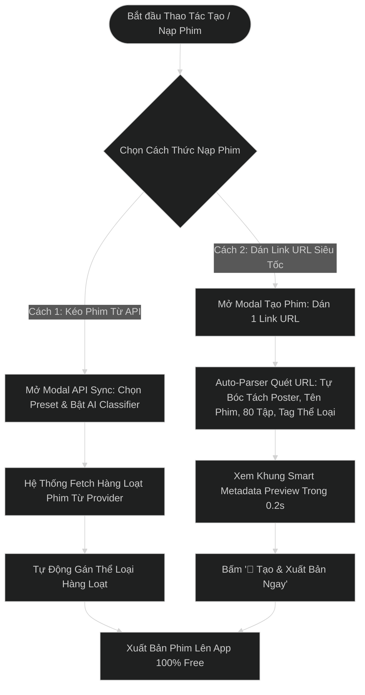

# TÀI LIỆU VẼ WIREFRAME & PHÂN TÍCH HỆ THỐNG BACK OFFICE (BO / CMS ADMIN PORTAL)
> **Dự án:** Nền Tảng Phim Ngắn Dọc PineDrama (Short Drama Platform)  
> **Giai đoạn:** PHASE 1 - CORE MVP OPERATIONAL PORTAL  
> **Tích hợp:** 3rd-Party External API Drama Import (No-Genre Support) & 3 Fast Tagging Solutions  
> **Mô hình vận hành App:** 100% Free Access – Mở khóa trọn bộ tất cả các tập phim  
> **Đơn vị thực hiện:** Senior BA & Product Owner & Lead UI/UX Designer  
> **Định dạng lưu trữ:** UTF-8 Standard  
> **Thư mục lưu:** `c:\Users\hoang\OneDrive\Desktop\Freelance\result_docs\Wireframe_BO_Phim_Ngan_PineDrama.md`

---

## 1. TỔNG QUAN HỆ THỐNG BACK OFFICE (BO PHASE 1)

### 1.1 Vai trò & Phạm vi Vận hành Phim API Phase 1
Hệ thống BO PineDrama Phase 1 được thiết kế tối ưu cho bài toán **Kéo dữ liệu Phim thô từ API Đối Tác (External API Import)** trong trường hợp dữ liệu đối tác **KHÔNG CÓ PHÂN LOẠI THỂ LOẠI (NO GENRE)**.

---

## 2. CHUYÊN ĐỀ 3 GIẢI PHÁP GÁN CATEGORY SIÊU TỐC KHI API KHÔNG CÓ THỂ LOẠI

### 🚀 Giải Pháp 1: Gán Category Mặc Định Ngay Khi Import API (Category Import Preset - Khuyên Dùng)
* **Cơ chế vận hành:** Khi mở Modal `[🔄 Kéo Phim Từ API]`, Admin chọn sẵn Category mặc định cho toàn bộ đợt kéo này (ví dụ: `[x] ❤️ Ngôn Tình`, `[x] 🔥 Hot Trend`).
* **Kết quả:** Khi bấm kéo 100 phim về, **100% phim mới tự động gán sẵn Category Ngôn Tình & Hot Trend** mà không cần con người đụng tay làm thủ công!

### 🤖 Giải Pháp 2: AI / Keyword Auto-Classifier (Tự Động Nhận Diện Theo Tên Phim & Mô Tả)
* **Cơ chế vận hành:** Hệ thống quét Tên bộ phim & Mô tả bằng từ khóa/AI:
  - Tên phim chứa *"Cô Vợ", "Tổng Tài", "Yêu", "Hôn Nhân"* -> Tự động gắn **`❤️ Ngôn Tình`**
  - Tên phim chứa *"Lật Kèo", "Báo Thù", "Trừng Phạt"* -> Tự động gắn **`⚔️ Trả Thù`**
  - Tên phim chứa *"Mẹ Chồng", "Nàng Dâu", "Gia Đình"* -> Tự động gắn **`🏡 Gia Đình`**
  - Tên phim chứa *"Chủ Tịch", "Triệu Phú"* -> Tự động gắn **`👑 Chủ Tịch Bá Đạo`**
* **Hiệu quả:** Phân loại tự động 95% số phim ngay trong lúc API đang nạp vào Database.

### 🏷️ Giải Pháp 3: Inline Quick-Tagging Desk (Bấm Nút Gán Nhanh 1-Click Trực Tiếp Trên Dòng)
* **Cơ chế vận hành:** Trên các dòng phim chưa có Category (`🟡 Chưa gán`), hệ thống hiển thị nút **`[+ Gán Ngôn Tình]`** / **`[+ Gán Trả Thù]`** trực tiếp trên bảng. Admin bấm 1 click là dòng phim đó đổi màu và gán Thể loại ngay lập tức.
* **Kết hợp Bulk Bar:** Tích chọn Checkbox N dòng -> Bấm `[🏷️ GÁN CATEGORY ĐỒNG LOẠT]` ở thanh Floating Bar.

---

## 3. SƠ ĐỒ LUỒNG KÉO PHIM API KHÔNG CÓ GENRE & TỰ ĐỘNG GÁN CATEGORY


---

## 3. CHUYÊN ĐỀ TẠO PHIM SIÊU TỐC BẰNG LINK URL (1-CLICK SMART URL PARSER)

### 🔗 3.1 Nhu Cầu & Bài Toán Thực Tế
* Khi người vận hành nhận được link nguồn phim từ đối tác (Link M3U8 Master Playlist, CDN Folder, Web Page phim, Google Drive, danh sách MP4...), việc phải nhập tay từng tên phim, tải từng tập hay cấu hình thủ công là rất mất thời gian.
* **Giải pháp 1-Click URL Importer**:
  1. **Chỉ cần dán 1 Link URL duy nhất** vào ô nhập.
  2. **Smart Metadata & Stream Parser**: Tự động bóc tách Poster thumbnail, Tên phim, Số lượng tập phim (chuẩn HLS FHD m3u8) và kiểm tra luồng phát (Stream Health Check).
  3. **Auto-Tagging AI**: Tự động nhận diện từ khóa trong URL/Metadata để gắn Thể loại (`❤️ Ngôn Tình`, `👑 Tổng Tài`, `🔥 Hot Trend`).
  4. **Xuất Bản Tức Thì (1-Click)**: Bấm `[🚀 TẠO & XUẤT BẢN NGAY]` -> Phim xuất hiện ngay trên danh sách BO và mở khóa xem 100% Free trên App Client!

---

## 4. SƠ ĐỒ LUỒNG KÉO PHIM API & TẠO PHIM BẰNG LINK URL



---

### MÀN HÌNH 1: MODAL TẠO MỚI BỘ PHIM (DÁN LINK URL / FORM TRỰC TIẾP)
```
+---------------------------------------------------------------------------------------------------+
| 🎬 TẠO MỚI BỘ PHIM (DÁN LINK URL TRỰC TIẾP)                                                 [X]  |
+---------------------------------------------------------------------------------------------------+
| TÊN BỘ PHIM (*):                                                                                  |
| [ Cô Vợ Sát Thủ & Tổng Tài Bá Đạo                                                               ] |
|                                                                                                   |
| LINK URL NGUỒN PHIM / M3U8 PLAYLIST (*):                                                          |
| [ https://cdn.shortdrama-partner.tv/series/tong-tai-ba-dao-co-vo-sat-thu-80eps/master.m3u8     ] |
| ✓ Link URL đã tự động bao gồm Poster ảnh bìa, toàn bộ tập phim & luồng video HLS                  |
| GÁN THỂ LOẠI (MULTI-SELECT SEARCH DROPDOWN - CHỨA N ITEMS):                                       |
| +-----------------------------------------------------------------------------------------------+ |
| | [❤️ Ngôn Tình ✕]  [👑 Tổng Tài ✕]  [🔥 Hot Trend ✕]   |  🔍 Tìm hoặc chọn thêm thể loại...   ▼| |
| +-----------------------------------------------------------------------------------------------+ |
|   | ┌─ DROPDOWN DANH SÁCH CUỘN (SCROLLABLE & SEARCH) ─────────────────────────────────────────┐ | |
|   | │ [🔍 Ô tìm kiếm nhanh theo từ khóa: ...................................................] │ | |
|   | │ [x] ❤️ Ngôn Tình                                                                        │ | |
|   | │ [x] 👑 Tổng Tài                                                                         │ | |
|   | │ [x] 🔥 Hot Trend                                                                        │ | |
|   | │ [ ] ⚔️ Trả Thù                                                                          │ | |
|   | │ [ ] 🏡 Gia Đình                                                                         │ | |
|   | │ [ ] 👻 Kinh Dị / Ma Mị                                                                  │ | |
|   | │ [ ] 🥋 Võ Thuật / Kiếm Hiệp                                                             │ | |
|   | │ ... (Chứa không giới hạn hàng trăm Category)                                            │ | |
|   | └─────────────────────────────────────────────────────────────────────────────────────────┘ | |
+---------------------------------------------------------------------------------------------------+
|                                                              [HỦY BỎ]   [💾 LƯU & TẠO PHIM NGAY]  |
+---------------------------------------------------------------------------------------------------+
```

### MÀN HÌNH 2: MODAL KÉO API VỚI GÁN MẶC ĐỊNH & AI CLASSIFIER
```
+---------------------------------------------------------------------------------------------------+
| 🔄 KÉO PHIM TỪ API ĐỐI TÁC (BAO GỒM API KHÔNG CÓ GENRE)                                     [X]  |
+---------------------------------------------------------------------------------------------------+
| 1. CHỌN ĐỐI TÁC API: [ ▼ Partner B (Dữ liệu thô - Chưa phân loại Genre)                         ] |
+---------------------------------------------------------------------------------------------------+
| 🚀 GIẢI PHÁP 1: GÁN MẶC ĐỊNH CATEGORY CHO ĐỢT IMPORT NÀY (DEFAULT PRESET):                        |
| Tất cả phim kéo về đợt này sẽ tự động gắn sẵn các Thể loại được chọn bên dưới:                     |
| [x] ❤️ Ngôn Tình     [ ] ⚔️ Trả Thù         [ ] 👑 Chủ Tịch Bá Đạo     [x] 🔥 Hot Trend         |
+---------------------------------------------------------------------------------------------------+
| 🤖 GIẢI PHÁP 2: BẬT AI TỰ ĐỘNG QUÉT TÊN & MÔ TẢ PHIM ĐỂ GÁN THỂ LOẠI (AI CLASSIFIER):            |
| [x] Tự động phân tích từ khóa tên phim (Cô vợ/Tổng tài -> Ngôn Tình, Lật kèo/Báo thù -> Trả thù)  |
+---------------------------------------------------------------------------------------------------+
|                                                     [HỦY BỎ]   [🚀 KÉO PHIM & TỰ ĐỘNG GÁN CATEGORY] |
+---------------------------------------------------------------------------------------------------+
```

### MÀN HÌNH 3: MÀN HÌNH ĐĂNG NHẬP BACK OFFICE (LOGIN PORTAL)
```
+---------------------------------------------------------------------------------------------------+
|                                 [P] PineDrama Back Office                                         |
|                          Cổng Quản Trị Hệ Thống & Vận Hành Phim Ngắn                              |
+---------------------------------------------------------------------------------------------------+
| EMAIL / TÊN ĐĂNG NHẬP:                                                                            |
| [ 👤 hoangbach@pinedrama.com                                                                    ] |
|                                                                                                   |
| MẬT KHẨU:                                                                                         |
| [ 🔒 •••••••••••••••••                                                                       👁️ ] |
|                                                                                                   |
| [x] Ghi nhớ đăng nhập 30 ngày                                                 [Quên mật khẩu?]    |
|                                                                                                   |
| [                          🚀 ĐĂNG NHẬP BACK OFFICE                                            ] |
|                                                                                                   |
| ------------------------ ⚡ ĐĂNG NHẬP NHANH DEMO (1-CLICK TEST) ---------------------------------- |
| [ 👑 Super Admin (Full) ]       [ 🎬 Content Manager ]            [ 🛡️ User Moderator ]           |
+---------------------------------------------------------------------------------------------------+
```

### MÀN HÌNH 4: QUẢN LÝ TÀI KHOẢN ADMIN
```
+---------------------------------------------------------------------------------------------------+
| ⚙️ QUẢN LÝ TÀI KHOẢN ADMIN                                                  [➕ Cấp Tài Khoản Mới]  |
+---------------------------------------------------------------------------------------------------+
| 👥 DANH SÁCH TÀI KHOẢN QUẢN TRỊ VIÊN:                       [🔍 Tìm Admin, Email...] [+ Thêm Admin]|
| STT  ADMIN & EMAIL              VAI TRÒ (ROLE)        QUYỀN HẠN               TRẠNG THÁI  HÀNH ĐỘNG |
| 01   Hoàng Bách (hoangbach@)    👑 Super Admin        ★ Full Quyền Hệ Thống    🟢 Active   [🔑] [✏️] |
| 02   Thu Trang (thutrang.c@)    🎬 Content Manager    Kéo API, Đăng Phim, Tag 🟢 Active   [🔑][🔒][🗑️]|
| 03   Hoàng Nam (nam.mod@)       🛡️ User Moderator     Quản Lý Người Dùng, Chat 🟢 Active  [🔑][🔒][🗑️]|
| 04   Bảo Trâm (tram.analyst@)   📊 Data Analyst       Xem Dashboard & Báo Cáo 🟢 Active   [🔑][🔒][🗑️]|
+---------------------------------------------------------------------------------------------------+
```

---

### MÀN HÌNH 4B: QUẢN LÝ NGƯỜI DÙNG & TRUNG TÂM CẤM CHAT / KHÓA ACCOUNT
```
+---------------------------------------------------------------------------------------------------+
| 👥 QUẢN LÝ NGƯỜI DÙNG & TRUNG TÂM CẤM CHAT / KHÓA ACCOUNT                   [📥 Xuất DS Vi Phạm]  |
+---------------------------------------------------------------------------------------------------+
| 🎯 BỘ LỌC: [ ▼ Tất cả trạng thái (Active / Inactive) ] [ 🔍 Tìm User ID, Tên... ] Tổng cộng: 4 Users|
| STT  USER ID / TÊN HIỂN THỊ     ĐĂNG NHẬP     NGÀY THAM GIA   TRẠNG THÁI        THAO TÁC QUẢN TRỊ |
| 01   Minh Anh (USR-9921)        Google        10/05/2026      🟢 Active         [🔇 Mute] [🔒 Ban]|
| 02   Tuấn Kiệt (USR-8812)       Google        02/06/2026      🟢 Active         [🔊 Unmute][🔒Ban]|
| 03   Spam_Bot_999 (USR-4402)    Google        15/07/2026      🔴 Inactive       [🔓 Mở Khóa Acc]  |
| 04   Phương Linh (USR-7731)     Google        22/07/2026      🟢 Active         [🔇 Mute] [🔒 Ban]|
+---------------------------------------------------------------------------------------------------+
```

---

### MÀN HÌNH 5: DASHBOARD TỔNG QUAN VẬN HÀNH (D-1 MẶC ĐỊNH & BỘ LỌC THEO THÁNG)
```
+-------------------------------------------------------------------------------------------------------------------------------+
| 📊 DASHBOARD TỔNG QUAN VẬN HÀNH                                                                                              |
| Thống kê hiệu suất lượt xem & chỉ số người dùng chốt sổ trọn vẹn ngày D-1 (10/08/2026)                                       |
+-------------------------------------------------------------------------------------------------------------------------------+
| BỘ LỌC THỜI GIAN: [ ⚡ D-1 (Hôm qua - Mặc định) ]  [ 🔴 Hôm nay (Live) ]  [ 📅 Theo Tháng: ▼ Tháng 08/2026 ] [ 📥 XUẤT BÁO CÁO CSV ] |
+-------------------------------------------------------------------------------------------------------------------------------+
| [ 1. TỔNG LƯỢT XEM D-1 ]   | [ 2. WATCH TIME D-1 ]     | [ 3. DAU USER D-1 ]       | [ 4. TỶ LỆ XEM HẾT BỘ D-1 ]               |
| 1,482,900                  | 82,450 Giờ                | 124,800                   | 68.5%                                     |
| ▲ +18.4% so với D-2        | ▲ +12.1% tăng trưởng      | ▲ +8.9% người dùng mới    | ▲ +5.2% trọn bộ 80 tập                    |
+-------------------------------------------------------------------------------------------------------------------------------+
| 📈 LƯỢNG TRUY CẬP THEO GIỜ (D-1 HOURLY: 00:00 - 23:59)            | 🔥 TOP 5 PHIM HOT NHẤT HÔM QUA (D-1)                       |
| [ ▂▃▅█▇█▆ ] Biểu đồ 24 giờ chốt sổ D-1                            | 1. Vợ Cũ Lật Kèo (80/80 Tập) • 342K Lượt xem              |
| 00:00  04:00  08:00  12:00  16:00  20:00(Peak)  23:59             | 2. Mẹ Chồng Siêu Cấp & Nàng Dâu • 285K Lượt xem           |
|                                                                   | 3. Hợp Đồng Hôn Nhân Với Tổng Tài • 210K Lượt xem         |
+-------------------------------------------------------------------------------------------------------------------------------+
```

### 5.1 Quy Tắc Nghiệp Vụ Bộ Lọc Dashboard (Business Rules - BA / PO Spec):
1. **Quy tắc D-1 Mặc Định (Default D-1 Closed Data):**
   * Mặc định khi Admin/Analyst truy cập Dashboard, hệ thống **luôn hiển thị dữ liệu ngày D-1 (Hôm qua)**.
   * **Lý do nghiệp vụ:** Dữ liệu D-1 đã được hệ thống Data Warehouse / ETL chốt sổ hoàn chỉnh 24 giờ (00:00:00 - 23:59:59), đảm bảo tính toàn vẹn và độ chính xác 100% khi đánh giá hiệu suất.
2. **Bộ Lọc Theo Tháng (Monthly Filter):**
   * Cho phép chọn Tháng hiện tại hoặc các tháng lịch sử (Tháng 08/2026, Tháng 07/2026, Tháng 06/2026...).
   * Khi chọn Tháng:
     - **Card KPI 1:** Tổng lượt xem lũy kế trong tháng (Monthly Views).
     - **Card KPI 2:** Tổng thời lượng xem trong tháng (Monthly Watch Time).
     - **Card KPI 3:** Chỉ số người dùng hoạt động trong tháng (MAU).
     - **Card KPI 4:** Tỷ lệ xem hết bộ trung bình trong tháng.
     - **Biểu đồ:** Tự động chuyển thành biểu đồ cột theo từng ngày / từng tuần trong tháng.
     - **Top Phim:** Hiển thị Top phim có lượt xem cao nhất trong toàn bộ tháng được chọn.
3. **Bộ Lọc Thời Gian Thực (Live / Realtime):**
   * Phục vụ theo dõi tải hệ thống trực tiếp trong ngày (CCU trực tiếp, tốc độ tăng trưởng lượt xem theo giờ).

---

---

### MÀN HÌNH 6: QUẢN LÝ BÁO CÁO & THỐNG KÊ CHI TIẾT (DETAILED REPORTING CENTER)
```
+-------------------------------------------------------------------------------------------------------------------------------+
| 📈 QUẢN LÝ BÁO CÁO & THỐNG KÊ CHI TIẾT                                                                                       |
| Khai thác sâu số liệu lượt xem, phim yêu thích, hành vi người dùng và xuất file báo cáo theo ngày/tháng                       |
|                                                                                    [ 📥 XUẤT FILE BÁO CÁO NÀY (EXCEL/CSV) ]   |
+-------------------------------------------------------------------------------------------------------------------------------+
| 🎯 BỘ LỌC ĐA CHIỀU:                                                                                                           |
| [ ⚡ Theo Ngày (D-1) ] [ 📅 Theo Tháng ] | Từ ngày: [10/08/2026] Đến: [10/08/2026]                                            |
| Thể loại: [ ▼ Tất cả thể loại ] | [ 🔍 Tìm tên phim, ID... ]                                        [ 🔍 ÁP DỤNG LỌC ]          |
+-------------------------------------------------------------------------------------------------------------------------------+
| [ 1. TỔNG LƯỢT XEM ]       | [ 2. PHIM XEM NHIỀU NHẤT ] | [ 3. PHIM YÊU THÍCH NHẤT ] | [ 4. USER HOẠT ĐỘNG (ACTIVE) ]         |
| 1,482,900                  | Vợ Cũ Lật Kèo              | Hào Môn Trả Thù            | 124,800 Users                          |
| ▲ 100% phim xem miễn phí   | 🔥 342,000 Lượt xem        | ❤️ 36,500 Lượt thích(98.2%)| ⏱️ TB 48.5 phút xem/User               |
+-------------------------------------------------------------------------------------------------------------------------------+
| ĐIỀU HƯỚNG BÁO CÁO (SUB-TABS):                                                                                                |
| [ 🎬 BÁO CÁO HIỆU SUẤT TỪNG PHIM ]        [ 👥 BÁO CÁO HÀNH VI & USER ]        [ 🏷️ BÁO CÁO TỶ TRỌNG THỂ LOẠI ]                 |
+-------------------------------------------------------------------------------------------------------------------------------+
| STT  POSTER  TÊN BỘ PHIM & ID    THỂ LOẠI     LƯỢT XEM  ❤️ LIKE    chia sẻ  ⏱️ TB/USER                              |
| #1   [VCLK]  Vợ Cũ Lật Kèo (80T) Ngôn Tình    342,000   28,400    12,500   48.2 phút                               |
| #2   [MCSC]  Mẹ Chồng Siêu Cấp   Gia Đình     285,000   24,100    9,800    41.5 phút                               |
| #3   [HDHN]  Hợp Đồng Hôn Nhân   Tổng Tài     210,000   31,200    15,200   52.0 phút                               |
| #4   [HMTH]  Hào Môn Trả Thù     Trả Thù      198,000   36,500(⭐) 18,900   55.8 phút                               |
| #5   [CVST]  Cô Vợ Sát Thủ       Ngôn Tình    165,000   19,800    7,400    39.0 phút                               |
+-------------------------------------------------------------------------------------------------------------------------------+
```

### 6.1 Các Báo Cáo Chuyên Sâu Tích Hợp (BA & PO Feature Scope):
1. **Báo Cáo Hiệu Suất Từng Phim (Drama Granular Metrics):**
   * Cho phép lọc và sắp xếp theo: Tổng lượt xem, Lượng yêu thích (Likes/Favorites), Lượng chia sẻ (Shares) và Thời gian xem trung bình mỗi User.
2. **Báo Cáo Hành Vi & User Retention:**
   * Tỷ lệ quay lại của người dùng theo chu kỳ Cohort (D1 Retention: 58.4%, D7: 34.8%, D30: 21.2%) và thời gian xem phim trung bình/ngày.
3. **Báo Cáo Tỷ Trọng Thể Loại (Category Breakdown):**
   * Thị phần xem giữa các thể loại (Ngôn Tình 45.2%, Trả Thù 26.8%, Gia Đình 16.5%, Tổng Tài 11.5%).

---

## 7. TỔNG KẾT

Hệ thống Back Office PineDrama hoàn thiện toàn bộ các cấu phần cốt lõi:
1. **Dashboard Tổng Quan Vận Hành:** Chế độ xem **D-1 mặc định**, tích hợp **Bộ lọc theo Tháng** và **Realtime Live**.
2. **Màn Hình Quản Lý Báo Cáo Chi Tiết (Report Center):** Hỗ trợ lọc đa chiều (ngày/tháng, thể loại, nguồn đối tác API), phân tích sâu hiệu suất từng bộ phim, độ yêu thích và hành vi người dùng.
3. **Màn Hình Đăng Nhập Bảo Mật:** Hỗ trợ đăng nhập đa vai trò, kiểm soát phiên làm việc và đăng nhập demo 1-click.
4. **Quản Lý Tài Khoản Admin:** Cấp phát tài khoản, phân chia vai trò (`Super Admin`, `Content Manager`, `User Moderator`, `Data Analyst`) và quản lý khóa/mở khóa/đổi mật khẩu.
5. **Dán Link URL Tạo Phim 1-Click:** Chỉ cần dán link URL nguồn (M3U8 / CDN / Web) là có trọn bộ phim phát hành ngay.
6. **Kéo API Phim Thô:** Kéo hàng trăm bộ phim từ API Đối tác với bộ lọc Gán Mặc Định Preset và AI Classifier.
7. **Multi-Select Category Dropdown:** Chọn nhiều thể loại phim linh hoạt kèm thanh cuộn và ô tìm kiếm thông minh.
