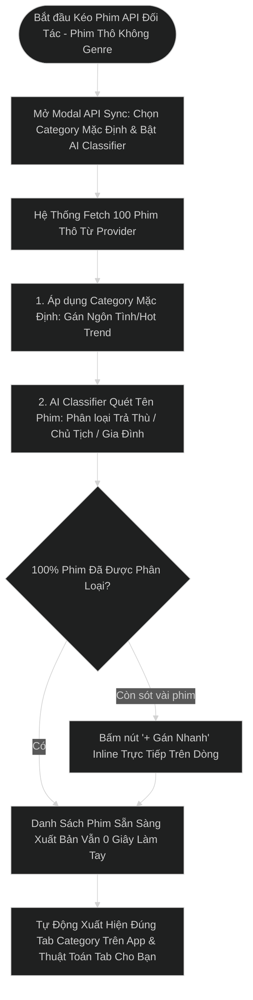

# TÀI LIỆU VẼ WIREFRAME & PHÂN TÍCH HỆ THỐNG BACK OFFICE (BO / CMS ADMIN PORTAL)
> **Dự án:** Nền Tảng Phim Ngắn Dọc PineDrama (Short Drama Platform)  
> **Giai đoạn:** PHASE 1 - CORE MVP OPERATIONAL PORTAL  
> **Tích hợp:** 3rd-Party External API Drama Import (No-Genre Support) & 3 Fast Tagging Solutions  
> **Mô hình vận hành App:** 100% Free Access – Mở khóa trọn bộ tất cả các tập phim  
> **Đơn vị thực hiện:** Senior BA & Product Owner & Lead UI/UX Designer  
> **Định dạng lưu trữ:** UTF-8 Standard  
> **Thư mục lưu:** `c:\Users\hoang\OneDrive\Desktop\Freelance\result_docs\Wireframe_BO_Phim_Ngan_PineDrama.md`

---

## 1. TỔNG QUAN HỆ THỐNG BACK OFFICE (BO PHASE 1)

### 1.1 Vai trò & Phạm vi Vận hành Phim API Phase 1
Hệ thống BO PineDrama Phase 1 được thiết kế tối ưu cho bài toán **Kéo dữ liệu Phim thô từ API Đối Tác (External API Import)** trong trường hợp dữ liệu đối tác **KHÔNG CÓ PHÂN LOẠI THỂ LOẠI (NO GENRE)**.

---

## 2. CHUYÊN ĐỀ 3 GIẢI PHÁP GÁN CATEGORY SIÊU TỐC KHI API KHÔNG CÓ THỂ LOẠI

### 🚀 Giải Pháp 1: Gán Category Mặc Định Ngay Khi Import API (Category Import Preset - Khuyên Dùng)
* **Cơ chế vận hành:** Khi mở Modal `[🔄 Kéo Phim Từ API]`, Admin chọn sẵn Category mặc định cho toàn bộ đợt kéo này (ví dụ: `[x] ❤️ Ngôn Tình`, `[x] 🔥 Hot Trend`).
* **Kết quả:** Khi bấm kéo 100 phim về, **100% phim mới tự động gán sẵn Category Ngôn Tình & Hot Trend** mà không cần con người đụng tay làm thủ công!

### 🤖 Giải Pháp 2: AI / Keyword Auto-Classifier (Tự Động Nhận Diện Theo Tên Phim & Mô Tả)
* **Cơ chế vận hành:** Hệ thống quét Tên bộ phim & Mô tả bằng từ khóa/AI:
  - Tên phim chứa *"Cô Vợ", "Tổng Tài", "Yêu", "Hôn Nhân"* -> Tự động gắn **`❤️ Ngôn Tình`**
  - Tên phim chứa *"Lật Kèo", "Báo Thù", "Trừng Phạt"* -> Tự động gắn **`⚔️ Trả Thù`**
  - Tên phim chứa *"Mẹ Chồng", "Nàng Dâu", "Gia Đình"* -> Tự động gắn **`🏡 Gia Đình`**
  - Tên phim chứa *"Chủ Tịch", "Triệu Phú"* -> Tự động gắn **`👑 Chủ Tịch Bá Đạo`**
* **Hiệu quả:** Phân loại tự động 95% số phim ngay trong lúc API đang nạp vào Database.

### 🏷️ Giải Pháp 3: Inline Quick-Tagging Desk (Bấm Nút Gán Nhanh 1-Click Trực Tiếp Trên Dòng)
* **Cơ chế vận hành:** Trên các dòng phim chưa có Category (`🟡 Chưa gán`), hệ thống hiển thị nút **`[+ Gán Ngôn Tình]`** / **`[+ Gán Trả Thù]`** trực tiếp trên bảng. Admin bấm 1 click là dòng phim đó đổi màu và gán Thể loại ngay lập tức.
* **Kết hợp Bulk Bar:** Tích chọn Checkbox N dòng -> Bấm `[🏷️ GÁN CATEGORY ĐỒNG LOẠT]` ở thanh Floating Bar.

---

## 3. SƠ ĐỒ LUỒNG KÉO PHIM API KHÔNG CÓ GENRE & TỰ ĐỘNG GÁN CATEGORY



---

## 3. CHUYÊN ĐỀ TẠO PHIM SIÊU TỐC BẰNG LINK URL (1-CLICK SMART URL PARSER)

### 🔗 3.1 Nhu Cầu & Bài Toán Thực Tế
* Khi người vận hành nhận được link nguồn phim từ đối tác (Link M3U8 Master Playlist, CDN Folder, Web Page phim, Google Drive, danh sách MP4...), việc phải nhập tay từng tên phim, tải từng tập hay cấu hình thủ công là rất mất thời gian.
* **Giải pháp 1-Click URL Importer**:
  1. **Chỉ cần dán 1 Link URL duy nhất** vào ô nhập.
  2. **Smart Metadata & Stream Parser**: Tự động bóc tách Poster thumbnail, Tên phim, Số lượng tập phim (chuẩn HLS FHD m3u8) và kiểm tra luồng phát (Stream Health Check).
  3. **Auto-Tagging AI**: Tự động nhận diện từ khóa trong URL/Metadata để gắn Thể loại (`❤️ Ngôn Tình`, `👑 Tổng Tài`, `🔥 Hot Trend`).
  4. **Xuất Bản Tức Thì (1-Click)**: Bấm `[🚀 TẠO & XUẤT BẢN NGAY]` -> Phim xuất hiện ngay trên danh sách BO và mở khóa xem 100% Free trên App Client!

---

## 4. SƠ ĐỒ LUỒNG KÉO PHIM API & TẠO PHIM BẰNG LINK URL


---

### MÀN HÌNH 1: MODAL TẠO MỚI BỘ PHIM (DÁN LINK URL / FORM TRỰC TIẾP)
```
+---------------------------------------------------------------------------------------------------+
| 🎬 TẠO MỚI BỘ PHIM (DÁN LINK URL TRỰC TIẾP)                                                 [X]  |
+---------------------------------------------------------------------------------------------------+
| TÊN BỘ PHIM (*):                                                                                  |
| [ Cô Vợ Sát Thủ & Tổng Tài Bá Đạo                                                               ] |
|                                                                                                   |
| LINK URL NGUỒN PHIM / M3U8 PLAYLIST (*):                                                          |
| [ https://cdn.shortdrama-partner.tv/series/tong-tai-ba-dao-co-vo-sat-thu-80eps/master.m3u8     ] |
| ✓ Link URL đã tự động bao gồm Poster ảnh bìa, toàn bộ tập phim & luồng video HLS                  |
|                                                                                                   |
| SỐ LƯỢNG TẬP PHIM:                      TRẠNG THÁI PHÁT HÀNH:                                     |
| [ 80                                  ] [ ▼ 🟢 Xuất bản ngay (Published)                        ] |
|                                                                                                   |
| GÁN THỂ LOẠI (MULTI-SELECT SEARCH DROPDOWN - CHỨA N ITEMS):                                       |
| +-----------------------------------------------------------------------------------------------+ |
| | [❤️ Ngôn Tình ✕]  [👑 Tổng Tài ✕]  [🔥 Hot Trend ✕]   |  🔍 Tìm hoặc chọn thêm thể loại...   ▼| |
| +-----------------------------------------------------------------------------------------------+ |
|   | ┌─ DROPDOWN DANH SÁCH CUỘN (SCROLLABLE & SEARCH) ─────────────────────────────────────────┐ | |
|   | │ [🔍 Ô tìm kiếm nhanh theo từ khóa: ...................................................] │ | |
|   | │ [x] ❤️ Ngôn Tình                                                                        │ | |
|   | │ [x] 👑 Tổng Tài                                                                         │ | |
|   | │ [x] 🔥 Hot Trend                                                                        │ | |
|   | │ [ ] ⚔️ Trả Thù                                                                          │ | |
|   | │ [ ] 🏡 Gia Đình                                                                         │ | |
|   | │ [ ] 👻 Kinh Dị / Ma Mị                                                                  │ | |
|   | │ [ ] 🥋 Võ Thuật / Kiếm Hiệp                                                             │ | |
|   | │ ... (Chứa không giới hạn hàng trăm Category)                                            │ | |
|   | └─────────────────────────────────────────────────────────────────────────────────────────┘ | |
+---------------------------------------------------------------------------------------------------+
|                                                              [HỦY BỎ]   [💾 LƯU & TẠO PHIM NGAY]  |
+---------------------------------------------------------------------------------------------------+
```

### MÀN HÌNH 2: MODAL KÉO API VỚI GÁN MẶC ĐỊNH & AI CLASSIFIER
```
+---------------------------------------------------------------------------------------------------+
| 🔄 KÉO PHIM TỪ API ĐỐI TÁC (BAO GỒM API KHÔNG CÓ GENRE)                                     [X]  |
+---------------------------------------------------------------------------------------------------+
| 1. CHỌN ĐỐI TÁC API: [ ▼ Partner B (Dữ liệu thô - Chưa phân loại Genre)                         ] |
+---------------------------------------------------------------------------------------------------+
| 🚀 GIẢI PHÁP 1: GÁN MẶC ĐỊNH CATEGORY CHO ĐỢT IMPORT NÀY (DEFAULT PRESET):                        |
| Tất cả phim kéo về đợt này sẽ tự động gắn sẵn các Thể loại được chọn bên dưới:                     |
| [x] ❤️ Ngôn Tình     [ ] ⚔️ Trả Thù         [ ] 👑 Chủ Tịch Bá Đạo     [x] 🔥 Hot Trend         |
+---------------------------------------------------------------------------------------------------+
| 🤖 GIẢI PHÁP 2: BẬT AI TỰ ĐỘNG QUÉT TÊN & MÔ TẢ PHIM ĐỂ GÁN THỂ LOẠI (AI CLASSIFIER):            |
| [x] Tự động phân tích từ khóa tên phim (Cô vợ/Tổng tài -> Ngôn Tình, Lật kèo/Báo thù -> Trả thù)  |
+---------------------------------------------------------------------------------------------------+
|                                                     [HỦY BỎ]   [🚀 KÉO PHIM & TỰ ĐỘNG GÁN CATEGORY] |
+---------------------------------------------------------------------------------------------------+
```

### MÀN HÌNH 3: MÀN HÌNH ĐĂNG NHẬP BACK OFFICE (LOGIN PORTAL)
```
+---------------------------------------------------------------------------------------------------+
|                                 [P] PineDrama Back Office                                         |
|                          Cổng Quản Trị Hệ Thống & Vận Hành Phim Ngắn                              |
+---------------------------------------------------------------------------------------------------+
| EMAIL / TÊN ĐĂNG NHẬP:                                                                            |
| [ 👤 longnguyen@pinedrama.com                                                                   ] |
|                                                                                                   |
| MẬT KHẨU:                                                                                         |
| [ 🔒 •••••••••••••••••                                                                       👁️ ] |
|                                                                                                   |
| [x] Ghi nhớ đăng nhập 30 ngày                                                 [Quên mật khẩu?]    |
|                                                                                                   |
| [                          🚀 ĐĂNG NHẬP BACK OFFICE                                            ] |
|                                                                                                   |
| ------------------------ ⚡ ĐĂNG NHẬP NHANH DEMO (1-CLICK TEST) ---------------------------------- |
| [ 👑 Super Admin (Full) ]       [ 🎬 Content Manager ]            [ 🛡️ User Moderator ]           |
+---------------------------------------------------------------------------------------------------+
```

### MÀN HÌNH 4: QUẢN LÝ TÀI KHOẢN ADMIN & MA TRẬN PHÂN QUYỀN (RBAC)
```
+---------------------------------------------------------------------------------------------------+
| ⚙️ QUẢN LÝ TÀI KHOẢN ADMIN & PHÂN QUYỀN (RBAC)               [🔐 Màn Hình Login] [➕ Thêm Admin]  |
+---------------------------------------------------------------------------------------------------+
| [ Tổng Admin: 4 ]      [ 👑 Super Admin: 1 ]     [ 🎬 Content: 2 ]         [ 🛡️ Moderator: 1 ]     |
+---------------------------------------------------------------------------------------------------+
| 👥 DANH SÁCH TÀI KHOẢN QUẢN TRỊ VIÊN:                                                             |
| STT  ADMIN & EMAIL              VAI TRÒ (ROLE)        QUYỀN HẠN               TRẠNG THÁI  HÀNH ĐỘNG |
| 01   Long Nguyen (longnguyen@)  👑 Super Admin        ★ Full Quyền Hệ Thống    🟢 Active   [🔑] [✏️] |
| 02   Thu Trang (thutrang.c@)    🎬 Content Manager    Kéo API, Đăng Phim, Tag 🟢 Active   [🔑][🔒][🗑️]|
| 03   Hoàng Nam (nam.mod@)       🛡️ User Moderator     Quản Lý User, Cấm Chat  🟢 Active   [🔑][🔒][🗑️]|
| 04   Bảo Trâm (tram.analyst@)   📊 Data Analyst       Xem Dashboard & Báo Cáo 🟢 Active   [🔑][🔒][🗑️]|
+---------------------------------------------------------------------------------------------------+
| 🛡️ MA TRẬN PHÂN QUYỀN CHI TIẾT THEO VAI TRÒ (RBAC MATRIX):                                        |
| Nhóm Quyền Hạn                   👑 Super Admin   🎬 Content Manager   🛡️ Moderator   📊 Analyst   |
| • Dashboard & Báo Cáo Thống Kê   ✅ Toàn quyền     ✅ Xem               ⛔ Không        ✅ Xem & CSV |
| • Kéo API, Tạo Phim & Category   ✅ Toàn quyền     ✅ Toàn quyền        ⛔ Không        ⛔ Không     |
| • Quản Lý User & Cấm Chat        ✅ Toàn quyền     ⛔ Không             ✅ Toàn quyền   ⛔ Không     |
| • Cấp Admin Mới & Phân Quyền     ✅ Toàn quyền     ⛔ Không             ⛔ Không        ⛔ Không     |
+---------------------------------------------------------------------------------------------------+
```

---

## 6. TỔNG KẾT

Hệ thống Back Office PineDrama hoàn thiện toàn bộ các cấu phần cốt lõi:
1. **Màn Hình Đăng Nhập Bảo Mật:** Hỗ trợ đăng nhập đa vai trò, kiểm soát phiên làm việc và đăng nhập demo 1-click.
2. **Quản Lý Tài Khoản Admin & RBAC:** Cấp phát tài khoản, phân chia 4 vai trò tiêu chuẩn (`Super Admin`, `Content Manager`, `User Moderator`, `Data Analyst`) kèm ma trận phân quyền chi tiết.
3. **Dán Link URL Tạo Phim 1-Click:** Chỉ cần dán link URL nguồn (M3U8 / CDN / Web) là có trọn bộ phim phát hành ngay.
4. **Kéo API Phim Thô:** Kéo hàng trăm bộ phim từ API Đối tác với bộ lọc Gán Mặc Định Preset và AI Classifier.
